# Memory Monkey

## Table of Contents

## About

    This product is a product designed using languages such as: HTML, CSS and Javascript. This product is designed to be a memory game whereby, the user (aged 10 years and older) would be shown a sequence of items flashed briefly. The user has to then replicate the objects shown in the correct order to proceed to the next level. The first sequence starts with only one object. Each round the proceeds, the sequence has an additional object shown. Therefore, the first round has one object, the second round has two objects, the third round has three objects. For each object correctly stated, 10 points are given. Once the user enters a wrong object, 2 points are removed from the score ad the user is prompted to enter a choice again and then submit the answer.

## Business Goals:

    1. To increase online awareness of Memory Monkey game through search engine optimization.
    2. To provide a product that allows users fun time activity during their leisure time.
    3. To provide a memory game that is easy to use, provides a challenge and fun.
    4. To provide a game that users can play from their phones, tablets, laptops and PC devices.
    5. Provide online social links to community.

## User Stories

    1. I would like to have a game that I know how to play where the rules are known.
    2. I would like a memory game that is online.
    3. I would like a memory game that I can play easily from my phone or tablet.
    4. I would like a game that is fun, easy to play and navigate.
    5. I would like a bit of a challenge in the memory game.
    6. I would like an easy searchable game to play.
    7. I would like to use a game where I can see my input in the memory game.
    8. I would like to see my score throughout the game.
    9. I would like to know the round of the game.
    10. I would like to see what i am entering as my choice for game answer.
    11. i would like option to delete my answer choice.
    12. I would like to join the online social media community of other memory monkey gamers.
    13. I would like to contact the admin staff to report bugs.

## Wireframes:

1. Home Page for mobiles, tablets and PC:
   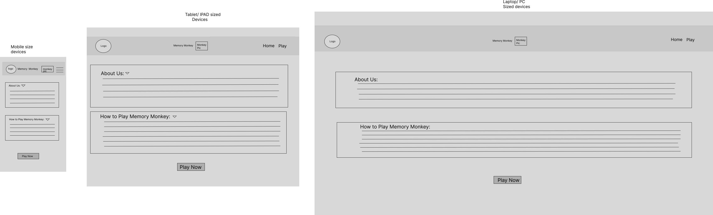

2. Game Page for mobiles, tablets and PC:
   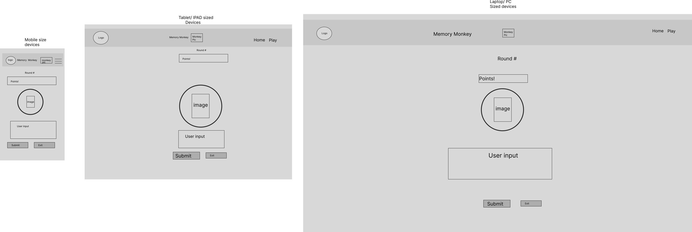

## Languages and Technologies Used:

1. HTML
2. CSS
3. JavaScript (ECMAScript)
4. Bootstrap version 5.3.8 Library - for navigation bar and other body elements and class
   implementation for styling.
5. Figma software was used to create the wireframes at https://www.figma.com
6. Google Fonts - orbitron, DynaPuff at https://fonts.google.com/
7. Chrome developer tools, Inspector, to manually check various functions and javascript elements.
8. Fontawesome Kit at https://fontawesome.com/
9. The W3C CSS Validation service at https://jigsaw.w3.org/css-validator/
10. The W3 Nu HTML Checker at https://validator.w3.org/nu/
11. Wave Web Accessibility Evaluation Tool at https://wave.webaim.org/
12. JS Lint (a validator for JavaScript) at https://www.jslint.com/

## Links Used

Internal Links:

- The Play link in the Navigation Bar goes to the Game page
- The Play Now button on the Home Page goes to the Game Page
- The Home Link in the Navigation bar goes to the Home Page
- The Monkeys on the Navigation Bar goes to the Home Page.

## Media Used

- Free Pik image for Navigation Bar - happy monkey cartoon character by Brgfx at www.freepik.com
  

## Results from Initial Testing

- Low Accessibility reports from check initially done
  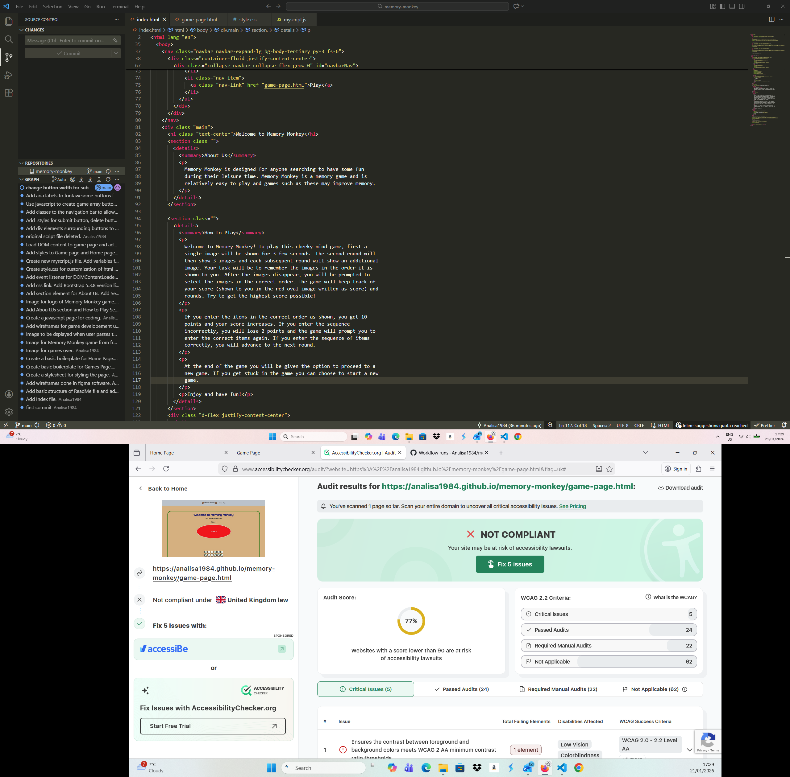

- Errors in the HTML Validator (discussed below - section elements in the home page have missing h2- h6 elements, missing aria labels in buttons)

- Errors in Accessibility Checks (contrast difference not sufficient, no text in the fontawesome buttons)

- No errors or warnings in the CSS Validation service done.

- Warnings in Javascript (continues to be unresolved)

## Fixed (Sections repaired based on recommendations from the accessibity checkers, HTML validators):

HTML Validator Errors:

- SECTION USED WITH NO h2 - h6 ELEMENTS (SINDEX PAGE)
  In the Home page, the section tags returned an error as there were no h2-h6 elements.
  This was fixed by replacing the section elements with div elements (as per the Nu HTML Checker advice).

- NO ARIA LABELS ON FONTAWESOME BUTTONS (GAME PAGE)
  In the Game page, there were 30 errors which all came from the buttons not having any aria labels.
  The buttons were all created in Javascript. However, this showed up as an HTML Validation error as the buttons were added by innerHTML and are HTML tag elements. This was rectified by adding the aria-labels attribute.

- TRAILING SLASHES ON VOID ELEMENTS (WARNING NOT ERROR)
  Prior to HTML 5, in older versions of HTML the back slashes were used on void elements. However, this is no longer required and it can react with attributes (as per the warning message). In VS Code, the formatting tool I personally use is prettier format. This formatting tool automatically adds the trailing slashes on the elements that require no closing tags. Also, the attributes are not interacting with the void elements. As this has showed as only a warning and continues to run as intended, so changes are required for now.

Accessibility Errors:

- NO TEXT INPUT ON FONTAWESOME BUTTONS (GAME PAGE)
  Despite the Game page buttons all having aria-labels, 30 errors again was reported due to the fontawesome buttons not having any text written in the buttons. Eventhough, there were symbols on each fontawesome button displayed and there were aria-labels for each of the button, there needed to be text displayed. This error was resolved by adding a span element within the fontawesome icon of the button. The span tag then had a class of font which was used in css to display none. For accessibility checks this was sufficient as there were already aria-labels and the buttons on display had a meaning to the user. Therefore, no additional accessibility help was required at this time.

- SCOREBOARD DIV ELEMENT (GAME PAGE) CONTRAST CHECK FAILED AS RED WAS NOT CONTRASTED ENOUGH.
  As per guidelines the background color of the scoreboard was not producing a sufficient contrast to meet guideline requirements of WGAC 2.0. The recommended color change by the validator was implemented to meet accessibility guidelines in terms on contrast differences.

- THERE WERE NO CSS ERRORS OR WARNINGS

- JS Lint showed several warnings on the Javascript code written

  These warnings included: messy whitespace, let (in the for loops), for, long comments, variables, this.

  To reduce the warnings which were acceptable, filter was added to the JS lint to remove some warning which were acceptable such as: messy whitespace, long, variable, this. After the filters were added the JS lint still produced warning which included using let in the for loop.
  Regardless, the Javascript was checked throughout the coding process and tested in the console of the web developer tools of the webpage. The JavaScript code does work and so far has not cause a hindrance in other programs. It is unclear why these warnings came up as most of these warnings tend to be present in normal code writing.

## Results from Final Testing

- Accessibility Checker using Wave Web Accessibility Evaluation Tool for Home Page.
  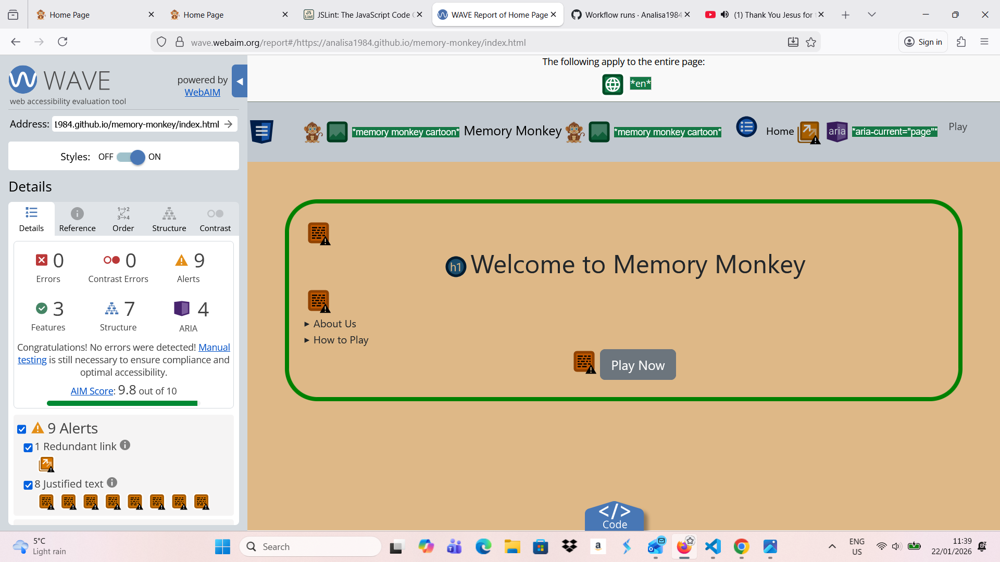

- Accessibility Checker using Wave Web Accessibility Evaluation Tool for Game Page.
  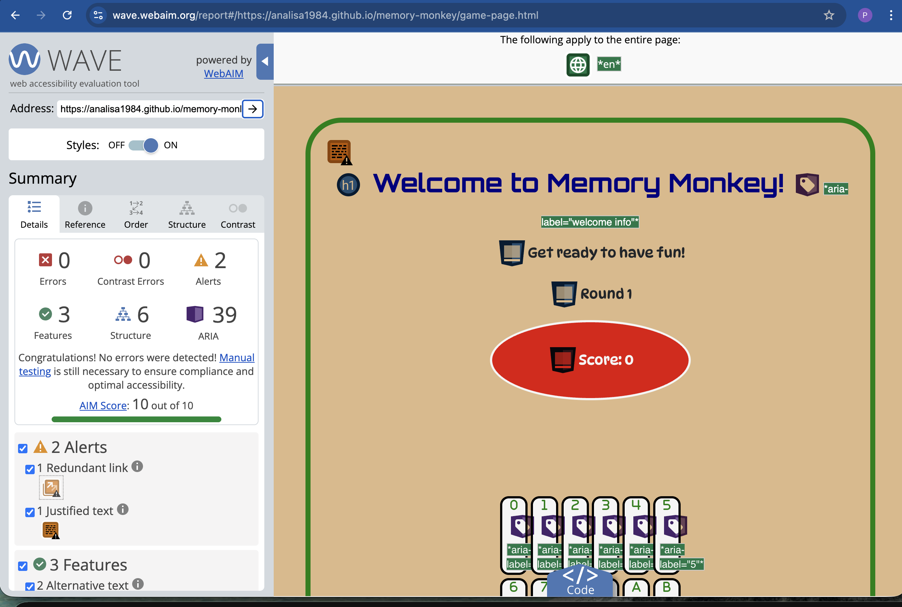

- HTML Validator Check using Nu HTML Checker for Home Page.
  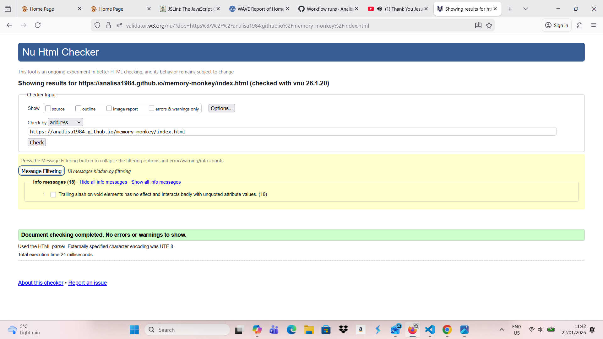

- HTML Validator Check using Nu HTML Checker for Game Page.
  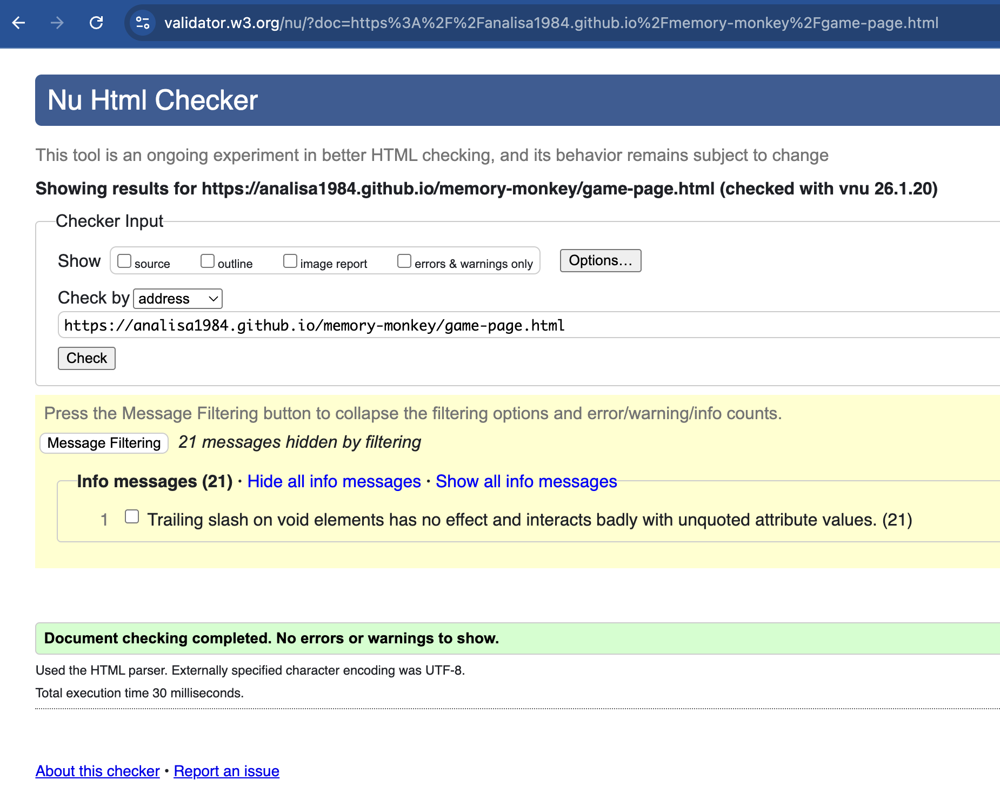

- CSS Validator Check using The W3C Validation CSS Service - for Home Page.
  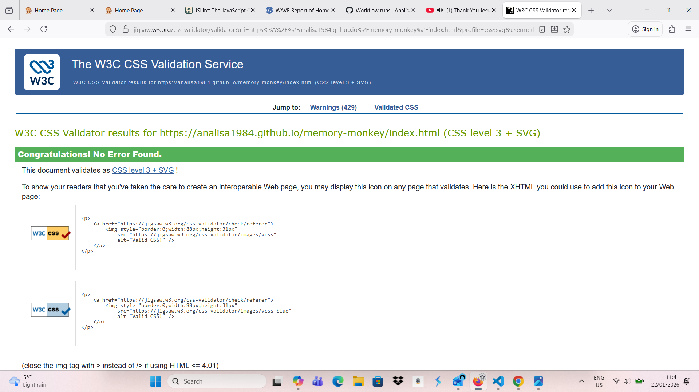

- CSS Validator Check using The W3C Validation CSS Service - for Game Page.
  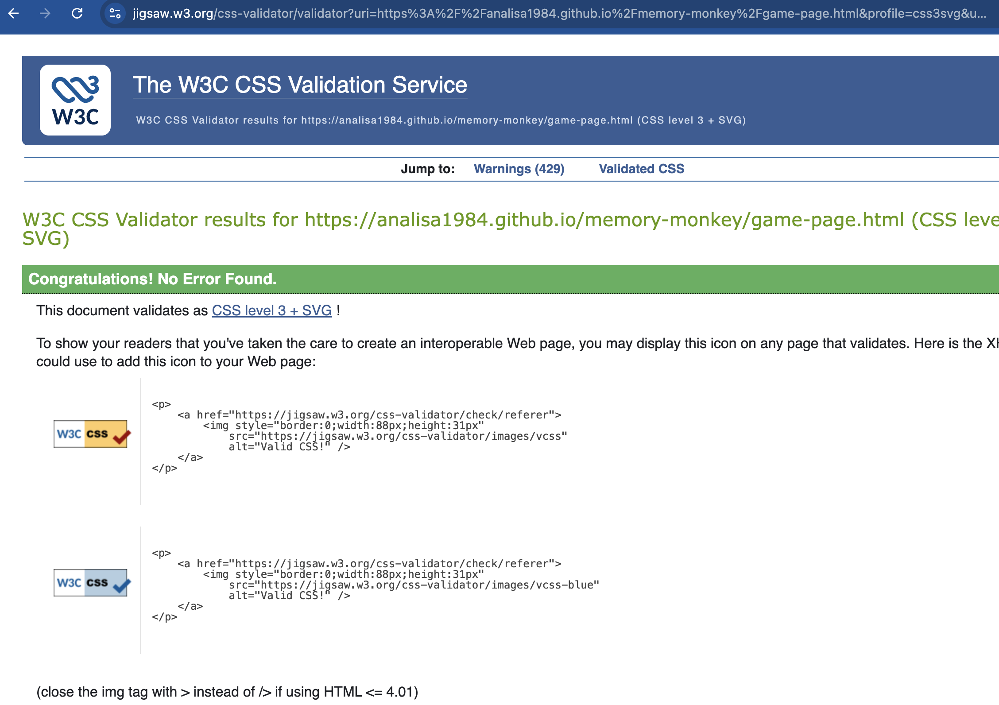

- JavaScript Validator using JS Lint (no filters)
  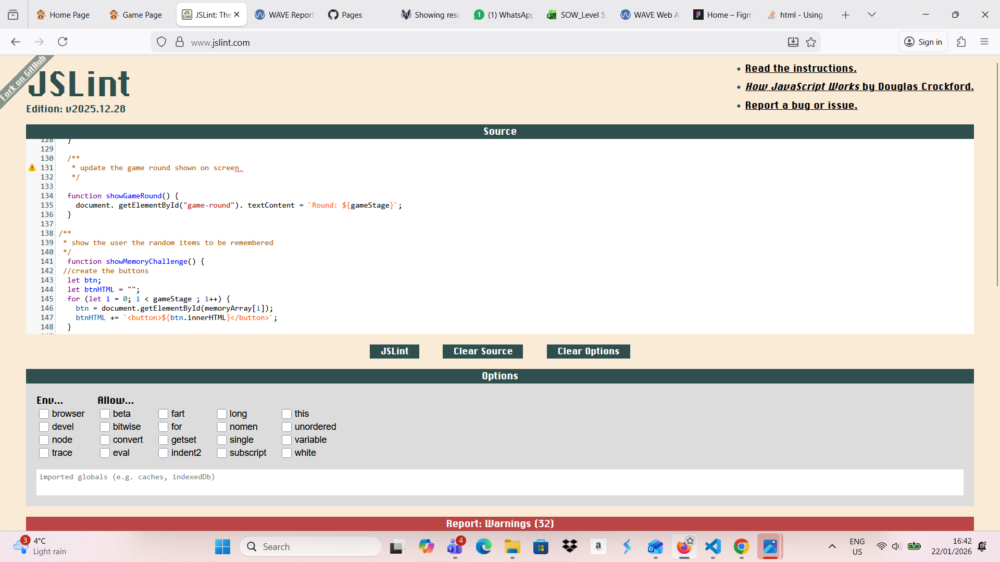

- JavaScript Validator using JS Lint (no filters)
  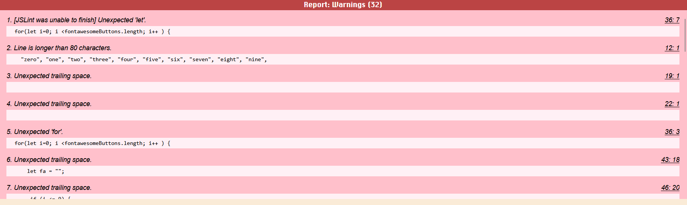

- JavaScript Validator using JS Lint (with filters)
  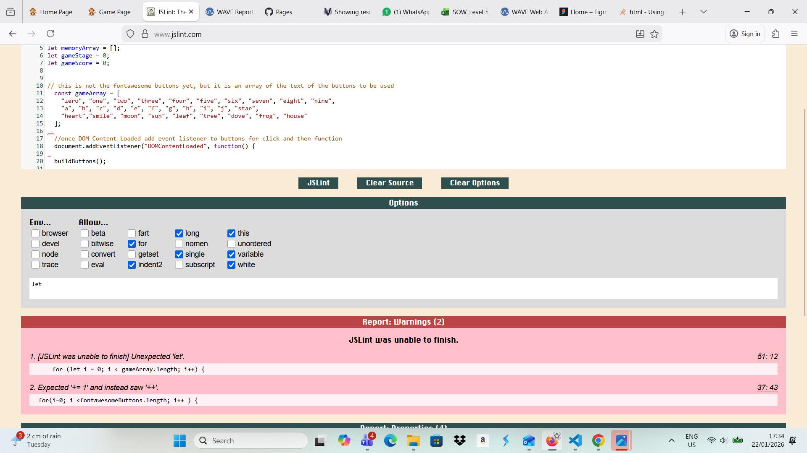

### Manual Testing

## Automated Testing

There are two approaches to developing a program, namely: Behavior Driven Development as well as Test Driven Development. In Behavior Driven Development, each aspect of the program is MANUALLY TESTED. Whereas, test driven development is an automated testing procedure whereby tests are created for each funtional aspect of the program created.

For automating testing, a node package manager (npm) with first have to be installed and then initialised on your code editor such as VS studio. Once inititalied, a separate testing folder is created to write the tests for the functions you write in the program you want. To test the function, you export the function. The tests are done before the functions are written. The first test will fail as the funtion does not yet exist.

Theoretically, for Memory Monkey, if automated testing were to be done, the tests that would be done for the startGame, deleteCard, initialMemoryItems, buildbuttons, newGame, checkAnswer, toStringSubset, isGameOver, endGame, showGameRound, showGameScore, setTimeout, showMemoryChallenge and showUserEntry functions. Some of these functions are built in javaScript functions such as setTimeout and toString. The require commmand at start of the file and module.export command need to be written on the function file being tested.

Forexample, testing deleteCard function:

1. Test deleteCard function - npm test would fail the test as initially there would be no deleteCard function.
2. Then create deleteCard function add the minimum amount (return startement) required to pass the test.
3. Next write the logic required to make the test pass for any input.
4. Also include options such as pressing the submit button and new-game button( as these should not have entered the user answer array) as well as keyboard inputs.
5. The test should include outside inputs to check that other inputs are not being entered into the user answer.

## Final Product

This product (Memory Monkey game) was designed to meet the goals of both the business as well as the potential users.

- Smaller devices such as mobile phones - the Home Page:
  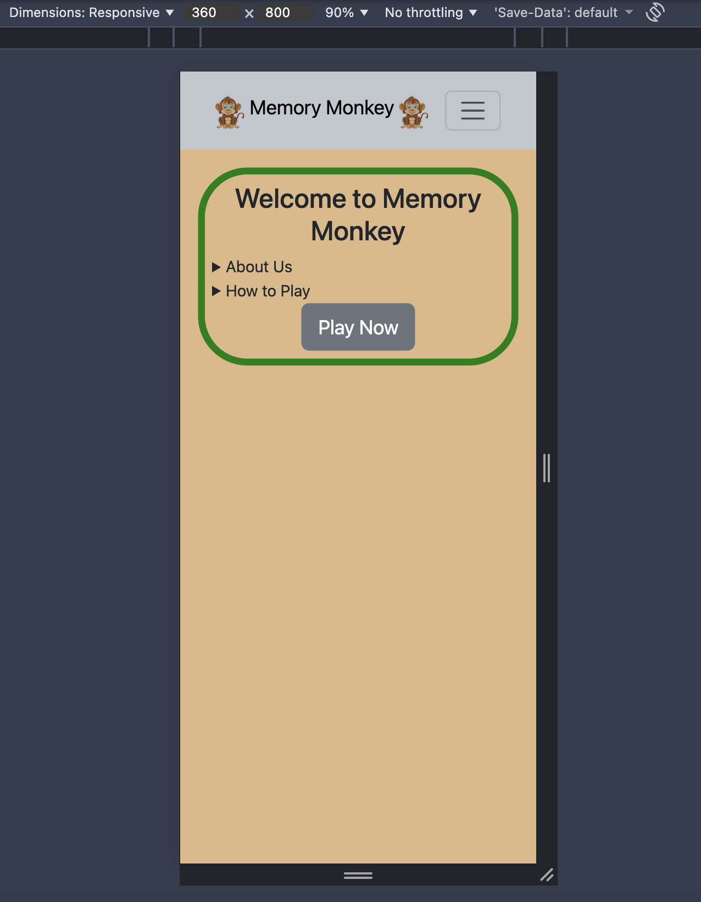

- Smaller devices such as mobile phones - the Game Page:
  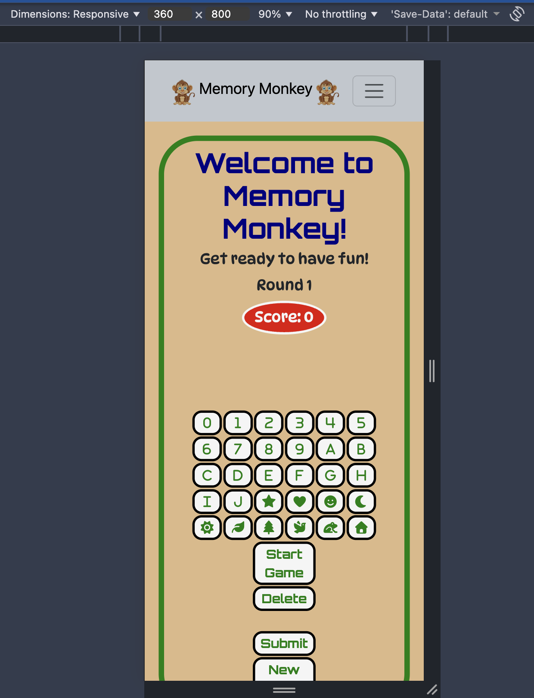

- Intermediate devices such as Ipad or tablets - the Home Page:
  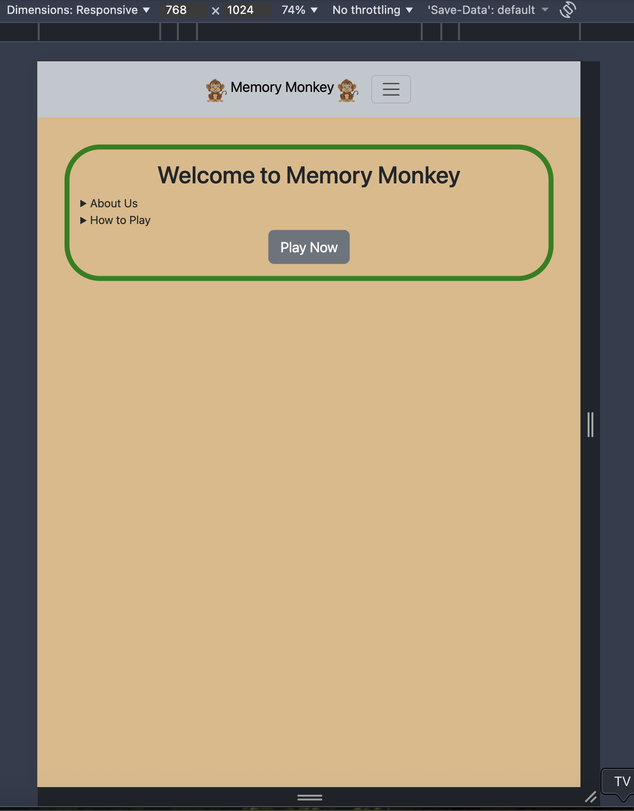

- Intermediate devices such as Ipad or tablets - the Game Page:
  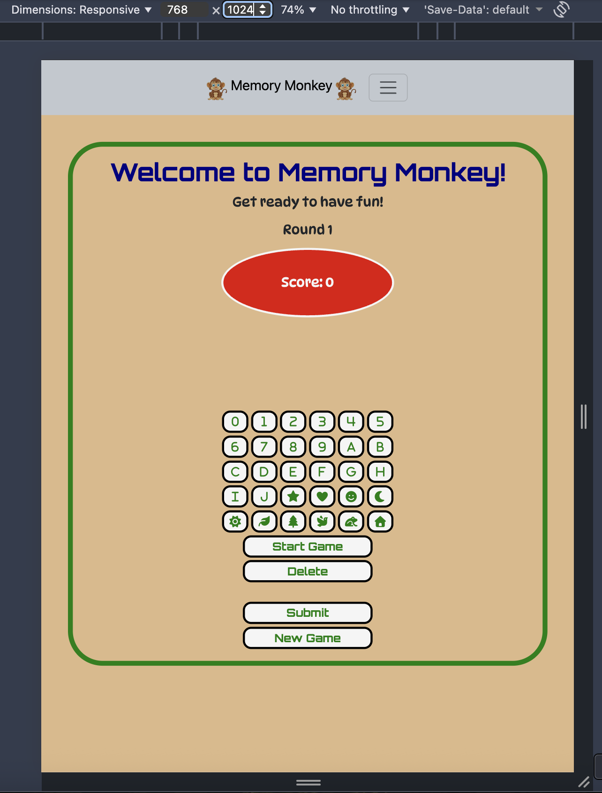

- Medium to Large sized devices such as laptop - the Home Page:
  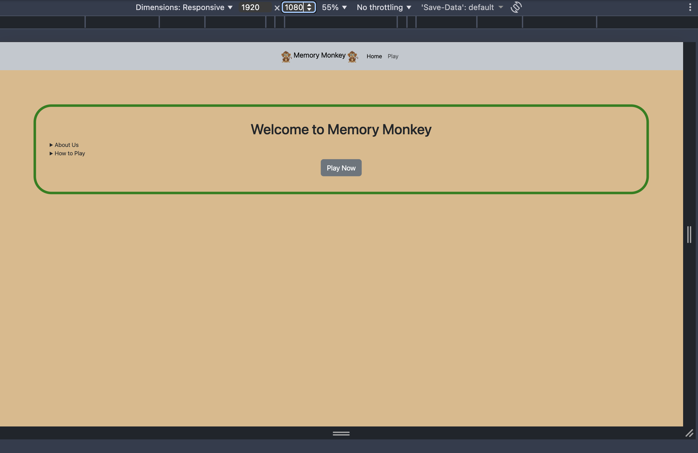

- Medium to Large sized devices such as laptop - the Game Page:
  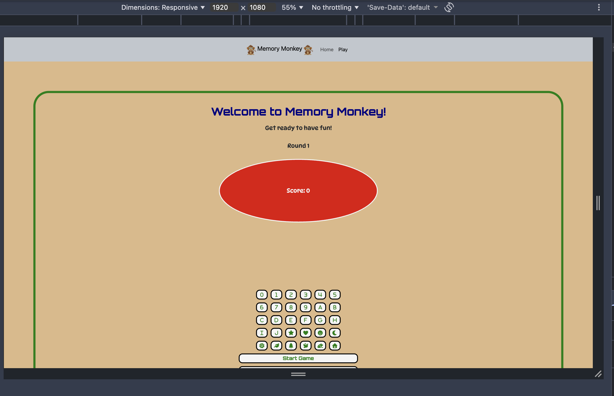

## Business Goals & User Stories Met:

## Deployment

Deployed to GitHub Pages on 21st January 2026.

- Local development environment
  Creating a local envrioment for future developers:

1. Create a github account on `github.com/signup` or login using `github.com/login`
2. Install git on your laptop, it is availible here for multiple operating systems `https://git-scm.com/install`
3. Install VS Code on your machine `https://code.visualstudio.com/download`
4. From the file menu `Open Folder` and select where you want to store the code
5. Open VS code, in the terminal window and open a bash terminal. This will be availible in Windows Mac and Linux
6. Clone the repository using `git clone https://github.com/Analisa1984/memory-monkey.git` (no login will be required as memory monkey is a public repository)

- Deploying via Github pages
  Creating a publicly accessible website:

1. Login to Github `github.com`
2. Go to the Memory Monkey repository `https://github.com/Analisa1984/memory-monkey`
3. Click Settings
4. Change to deploy branch and select `Main`
   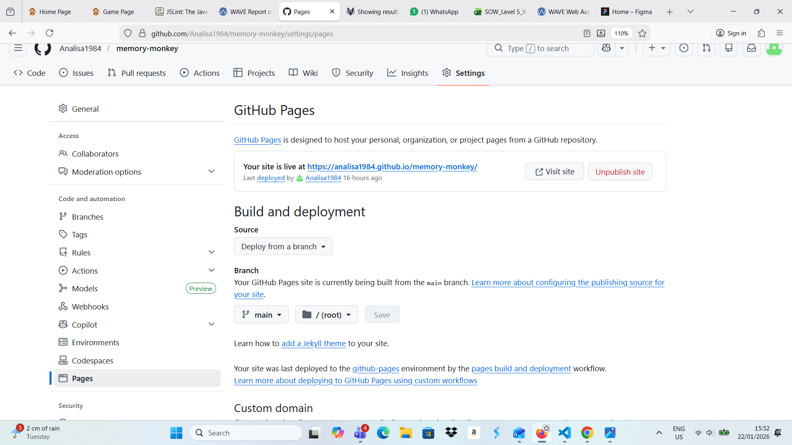
5. Push changes to the main branch, this will automatically deploy the website.

## The Design of Memory Monkey and How to play (use the product):

This product is a memory game aimed at individuals aged 10 years and over. This game has 2 pages the Home page and the Game page. - This product has a clear and simple design made easy for users to navigate.

Only 2 pages:
There are 2 pages in Memory Monkey. The Home Page and the Game Page.
Both pages have the same Navigation bar on top, a burlywood brownish background and information centered within a green rectangular border. This was done to bring some sense of uniformity to the product. The design was made in a way to make the call to action button (PLAY NOW) easiy accessible and not hidden away. The colors are warm and enticing and not bright and sharp. Font stylings and sizes chosen are clear and legible.

Same Navigation Bar in both pages:
Both pages have the same bootstrap 5 customized navigation bar located at the top of the page. The navigation bar, remains on the top and does not move as the user scrolls down the page. The logo, game name and navigation links are all centered. The navigation links are displayed on intermediate and larger devices where as on medium and smaller screens, the navigation links are condensed into a burger menu and the user would have to click on the menu to see the navigation links. This was done intentionally so that the navigation links do not appear squished on smaller screens and the appearance remains neat on all devices. The Logo (monkeys), the memory monkey title and the Home link always leads to the home page. The Play Now navigation link leads to the game Page.

Home Page:
After the navigation bar at the top, the user is greeted by 2 detail sections : About Us and How to Play. These are drop down features that expand with information as the user clicks on them. This feature was added with the focus for users on mobile phones, so that thier device remains free from clutter and to make the "Play Now" button (Call to Action) very easily accessible and not hidden away by any clutter.

Game Page:
After the navigation bar at the top, the user is greeted by a Welcome to Memory Monkey and Get ready to have fun statement as a welcome statement. Following this, the user sees the Round number, and score board which remains there throughout the entire game.

score board - The score is white and it is encompassed in a red oval with a white border. This remains the same shape with scaling to various device sizes. The red background brings some excitement as it is a game and draws the user to the score easily.

Game input area - The Game input area was clearly defined by adding a div and placing a height. This prevented the other elements from shifting up and down after the randomized item disappeared.

This game is aimed at individuals who would like to have some challenging fun during their leisure time. The Home Page has an About Us section as well as the instructions on how to play the game. The Call to action button, which is the play button on the Home page and the play link on the Navigation bar are readily visible and easy to get to.

The About section lets user know that this is a memory game that has a total of 10 rounds. In this game the user with be shown a series of random cards.
1st round --> 1 item shown,
2nd round --> 2 items shown,
3rd round --> 3 items shown,
.
.
.
10th round --> 10 items shown

In the game, the Round is displayed on top and the score board is in red with a white cirle presnt throughout the game. As a user plays, the maximum number of points possible to gai is 10 points per round. With a maximum of 100 total points to get for 10 rounds. Each round shows the items within 3 seconds. After the 3 seconds are completed, the items disappear.

The instructions let the user know that the user has to replicate the answer exactly as it was shown. To enter an answer selection, the user would have to click or tap on the screen (if the user is using a touch screen device)

## References

1. Free Pik royaly free image for Navigation Bar - happy monkey cartoon character by Brgfx at www.freepik.com
2. Bootstrap 5.3.8 version library utlized.
3. Figma software used to create the wireframes for mobiles, tablets and laptops and larger devices.
4. Google Fonts - orbitron, DynaPuff at https://fonts.google.com/
5. Fontawesome Kit at https://fontawesome.com/
6. The W3C CSS Validation service at https://jigsaw.w3.org/css-validator/
7. The W3 Nu HTML Checker at https://validator.w3.org/nu/
8. Wave Web Accessibility Evaluation Tool at https://wave.webaim.org/
9. JS Lint (a validator for JavaScript) at https://www.jslint.com/
10. Chrome developer tools, Inspector, to manually check various functions and javascript elements.

### Content

## Issues:

## Limitations and Future Development:

Memory Monkey is a fun game that allows the user to play a memory game of 10 rounds. However, as the game is there can be room for further imporvements such as :

- For future development, a hint button can be added which shows the user the card(s) that was initially shown but maybe of a shorter period of time.
- There can be an End Game button so that the user can choose to leave and quit the game at any time.
- to make the game more challenging there can be a timer option so that the user has to input his/her options in a specified amount of time.
- There can be an option for the user to select how many rounds they would like to have.
- There can be a storage area built so that game remembers their past scores so that a user may want to improve from their last score.
- There can be an option for multiple user/ players to play the game.
- Future development can be to add a Contact Us section as well as social media Join Us section.
- This product has not had user acceptance testing and this would be advisable for regular business projects.

## Acknowledgements

1. God Almighty
2. Code Institute and all staff for all lectures and learning materials provided throughout the course thus far.
3. FreePik for royalty images used in the game (monkey)

### Thank you for reviewing this product!
